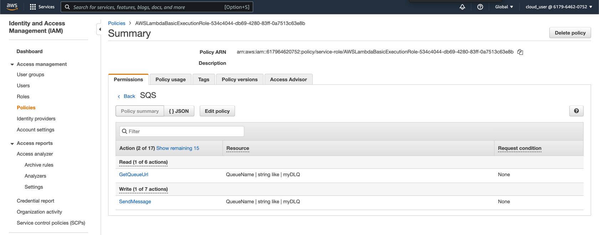
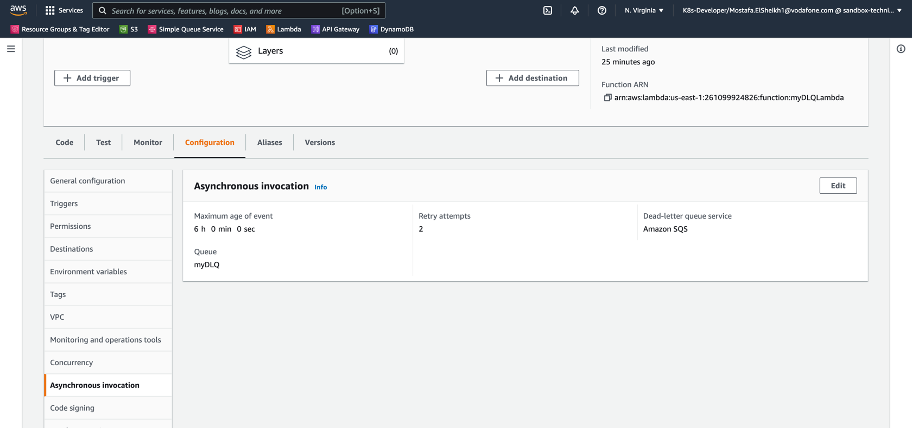
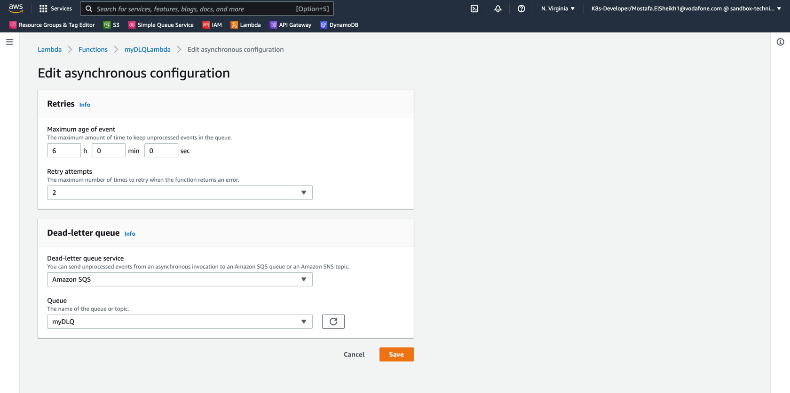
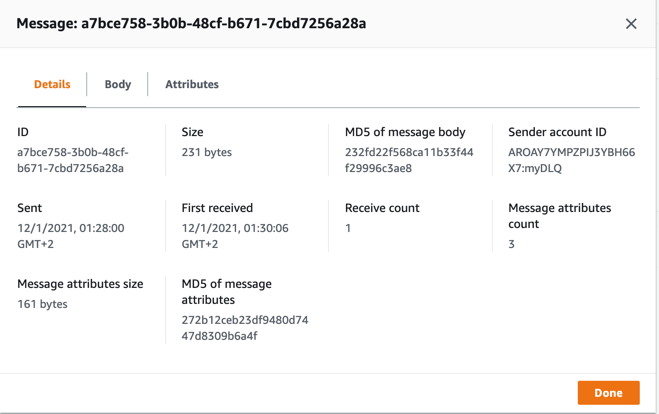
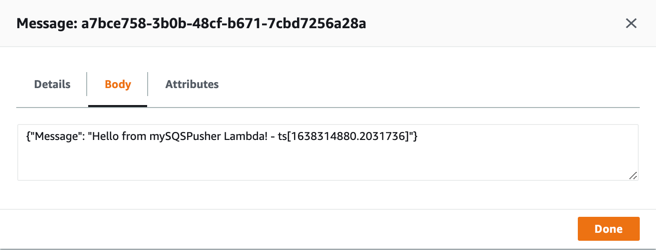
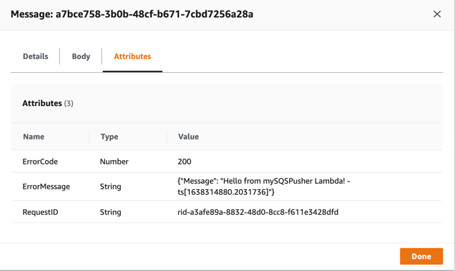

# LambdaDLQ

Create a Lambda function that send messages to Dead-letter queue of SQS

## Getting Started

- Create Standard SQS
- Create Lambda Function
- Give "SendMessage" and "GetQueueUrl" permission to Lambda function

- Configure Dead-letter queue service for Lambda function
  - **Using AWS Console:** Go to "Configuration" -> "Asynchronous Invocation" -> "Edit" -> Select "Amazon SQS" -> Select created SQS
  
  
  - Using AWS CLI: Run `% aws lambda update-function-configuration --function-name myDLQ --dead-letter-config TargetArn=arn:aws:sqs:us-east-1:617964620752:myDLQ`
    ```shell
    {
        "FunctionName": "myDLQ",
        "FunctionArn": "arn:aws:lambda:us-east-1:617964620752:function:myDLQ",
        "Runtime": "python3.9",
        "Role": "arn:aws:iam::617964620752:role/service-role/myDLQ-role-2v0losyj",
        "Handler": "lambda_function.lambda_handler",
        "CodeSize": 407,
        "Description": "",
        "Timeout": 3,
        "MemorySize": 128,
        "LastModified": "2021-11-30T21:29:06.000+0000",
        "CodeSha256": "aH0Y3CwE3vg87JYElno+MFlQ9rVLDld1/UaZSXgrj4M=",
        "Version": "$LATEST",
        "DeadLetterConfig": {
            "TargetArn": "arn:aws:sqs:us-east-1:617964620752:myDLQ"
        },
        "TracingConfig": {
            "Mode": "PassThrough"
        },
        "RevisionId": "fced9ec4-5f85-4cdf-82dd-cb38d0a51748",
        "State": "Active",
        "LastUpdateStatus": "InProgress",
        "LastUpdateStatusReason": "The function is being created.",
        "LastUpdateStatusReasonCode": "Creating",
        "Architectures": [
            "x86_64"
        ]
    }
    ```
- Deploy Code by running the below command and upload output generated in dist folder into Lambda as a .zip package
    ```shell
    ./build.sh -m myDLQSender
    ```

## Message Sample

### Details


### Body


### Attributes


### Logs


## Side Notes

- When Lambda polls message from SQS it pushes it to an internal queue, and in case of any failure it retries to send it back by default for 3 times, if it fails, it pushes it to its DLQ 
- To configure DLQ for Lambda, it should be granted "sqs:SendMessage" permission

## Resources
- [[2016-12] AWS Lambda Supports Dead Letter Queues](https://aws.amazon.com/about-aws/whats-new/2016/12/aws-lambda-supports-dead-letter-queues/)
- [[Discussion] Is there any way to explicitly send event message to dead letter queue from inside AWS lambda function on certain condition?](https://stackoverflow.com/questions/49414030/is-there-any-way-to-explicitly-send-event-message-to-dead-letter-queue-from-insi)
- [[Video] Failure Handling Using a Lambda DLQ (Dead Letter Queue)](https://www.youtube.com/watch?v=nqQh2KmHiLY)
- [[Docs] AWS Lambda > Developer Guide > Async Invocation > Dead-letter queues](https://docs.aws.amazon.com/lambda/latest/dg/invocation-async.html#invocation-dlq)
- [[Docs] [SDK] Amazon SQS - Example sending and receiving messages](https://boto3.amazonaws.com/v1/documentation/api/latest/guide/sqs-example-sending-receiving-msgs.html)
- [[Docs] [SDK] Amazon SQS - SQS.Client.send_message](https://boto3.amazonaws.com/v1/documentation/api/latest/reference/services/sqs.html#SQS.Client.send_message)
- [[Docs] [SDK] Using dead-letter queues in Amazon SQS](https://boto3.amazonaws.com/v1/documentation/api/latest/guide/sqs-example-dead-letter-queue.html)
- [[Article] Using Amazon SQS dead-letter queues to replay messages](https://aws.amazon.com/blogs/compute/using-amazon-sqs-dead-letter-queues-to-replay-messages/)
- [[Article] Calling an AWS Lambda function from another Lambda function](https://www.sqlshack.com/calling-an-aws-lambda-function-from-another-lambda-function/)
- [[Docs] [CLI] AWS Lambda > Developer Guide > DeadLetterConfig](https://docs.aws.amazon.com/lambda/latest/dg/API_DeadLetterConfig.html)
- [[Docs] Amazon SQS dead-letter queues](https://docs.aws.amazon.com/AWSSimpleQueueService/latest/SQSDeveloperGuide/sqs-dead-letter-queues.html)
- [[Discussion] Error when sending message from lambda to DLQ](https://stackoverflow.com/questions/64325934/error-when-sending-message-from-lambda-to-dlq)
- [[Docs] Amazon SQS > Developer Guide > Amazon SQS dead-letter queues](https://docs.aws.amazon.com/AWSSimpleQueueService/latest/SQSDeveloperGuide/sqs-dead-letter-queues.html)
